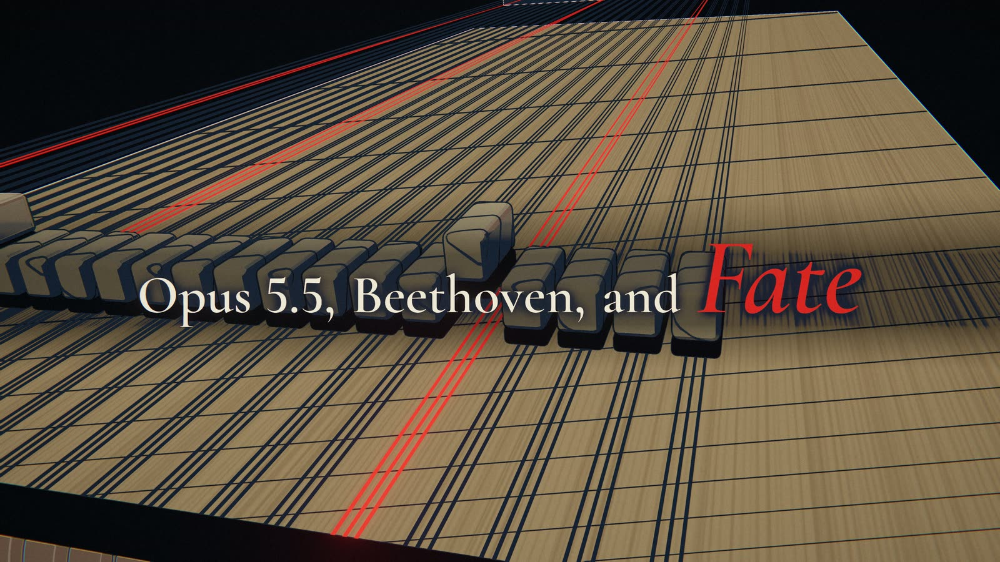
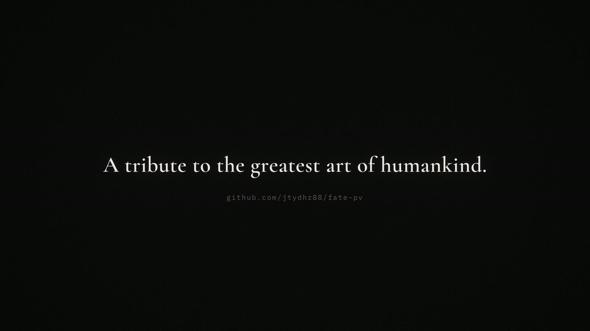

# fate-pv (命运PV)

English | [中文](README.zh-CN.md)

*Opus 5.5, Beethoven, and Fate* (《Opus 5.5，贝多芬，和命运》), a five-minute, code-rendered music video for classical music, made with
Claude (Opus 5.5) in Claude Code. Every frame is a pure function of time and every note on screen is
engraved, lit and animated at the exact moment it sounds. The timing doesn't come from audio analysis: it
comes from the score itself. The audio is rendered from the same note list the visuals read, so picture
and sound are in sync note for note. No image or video generation model is used anywhere.



## The film

| | Music | Plate |
|---|---|---|
| opening | the orchestra tuning | the title on black: *Opus 5.5, Beethoven, and Fate* |
| 1 | **Beethoven**, Symphony No. 5, I, bars 1–58 | the knock inside a piano (the title stamped word by word), the motif engraved on a printed page, the seating plan and a next-note model, the 88 keys, the player-piano roll, the city of light |
| 2 | **Mozart**, Symphony No. 40, I, bars 1–28 | a rococo blue-and-white porcelain salon: the strings bowing on a painted dish, the winds and horns, Mozart's dice game sampling every bar |
| 3 | **Vivaldi**, Summer, III, bars 1–20 | a weather station: the wheat field as a spectrum cut down by the hail, lightning on the sforzandi, the sonnet's line |
| 4 | **Bach**, Toccata in D minor, BWV 565 | the organ as a machine room: pipes as server racks, stops as hyperparameters, the music desk playing the score, the rose window |
| 5 | **Grieg**, In the Hall of the Mountain King | a server hall inside the mountain: the mine cart on the staff, the loop overclocking, shadow-puppet trolls, SYSTEM OVERLOAD |
| 6 | **Beethoven**, Symphony No. 7, II | burins cutting the voices into a guilloche medallion of light, one more for each layer of the theme |
| 7 | **Beethoven**, Symphony No. 9, IV (the Ode to Joy) | a world map at night lit city by city from Vienna, until everyone sings |
| 8 | **Beethoven**, Symphony No. 5, III → IV and the end | back inside the piano: a hammer repeating the timpani's C in the dark, then gold, the only gold in the film |
| epilogue | silence | *Life is short, art is long* (Hippocrates), and the dedication |

The key runs from C minor through G, D, B and A minor to the C major of the finale. Red belongs to the
fate motif, gold to the finale. Each piece has its own visual language and grade ramp; plates hand over by
matching their last and first frames. Chinese and English versions differ only in the title, one caption
and the epilogue.

<table>
<tr><td width="33%"><br><sub>Beethoven 5: the knock engraved and annotated</sub></td><td width="33%"><br><sub>Beethoven 5: the seating plan and the next-note model</sub></td><td width="33%"><br><sub>Beethoven 5: the 88 keys under the fermata</sub></td></tr>
<tr><td width="33%"><br><sub>Beethoven 5: the player-piano roll</sub></td><td width="33%"><br><sub>Beethoven 5: the city of light</sub></td><td width="33%"><br><sub>Mozart 40: the rococo porcelain salon</sub></td></tr>
<tr><td width="33%"><br><sub>Mozart 40: the winds and horns</sub></td><td width="33%"><br><sub>Mozart 40: the dice game sampling every bar</sub></td><td width="33%"><br><sub>Vivaldi: hail and lightning over the wheat</sub></td></tr>
<tr><td width="33%"><br><sub>Bach: the organ as a machine room</sub></td><td width="33%"><br><sub>Bach: the music desk playing the Toccata</sub></td><td width="33%"><br><sub>Grieg: the server hall inside the mountain</sub></td></tr>
<tr><td width="33%"><br><sub>Grieg: the shadow-puppet trolls</sub></td><td width="33%"><br><sub>Beethoven 7: burins cutting the medallion</sub></td><td width="33%"><br><sub>Ode to Joy: the world lit up</sub></td></tr>
<tr><td width="33%"><br><sub>The finale: the timpani's C in the dark</sub></td><td width="33%"><br><sub>The finale: gold, inside the piano</sub></td><td width="33%"><br><sub>The epilogue</sub></td></tr>
</table>

## Roadmap

For now this repository serves one film: the scenes, the edit and the data are written for this video and
nothing else. Later it may grow into an engineering project for films like it:

- **Your own score**: bring a MusicXML or MIDI file, mark the bars and the tempo liberties, and get the
  timing data, the sampled orchestra and a first cut. The music side already works from score data alone.
- **Plates from score features**: analyse a score for what it does (a motif passed between voices,
  fermatas and general pauses, repeated-note tremolo, an ostinato that accelerates, voices entering layer
  by layer, a turn from minor to major) and offer plate templates that answer each feature, the way the
  plates of this film answer theirs.
- **Adjustable cameras**: shot lists as editable data (keys, lenses, cuts on beats) with an editor in the
  preview, instead of camera paths written inside each scene.
- **Effect design**: particles, grade ramps, outlines and post as reusable presets with parameters.
- **Agent-driven**: a coding agent reads the score, proposes the plates and the shot list, renders
  previews and iterates on notes, as we did here.

None of this is promised; it is where the project could go once the film is done.

## Inspired by

[**mexicat/pdoom-video**](https://github.com/mexicat/pdoom-video), the code-rendered music video for
*I'm Upping My P(doom)*, made with Claude in Claude Code. Its renderer is the starting point of ours (MIT,
see `LICENSE.pdoom-engine`): deterministic frames as a pure function of time, adaptive motion blur,
bloom/halation/grain post, headless-Chrome export to ffmpeg; and so is its method: one visual idiom and one
concrete object per plate, a style bible before code. The lyric layer is replaced here by a score layer.

## Related

Our professional skill libraries for Claude, used alongside this project:

- [screenwriting-skills](https://github.com/jtydhr88/screenwriting-skills), screenwriting (film, TV, stage)
- [music-composition-skills](https://github.com/jtydhr88/music-composition-skills), composition and arrangement
- [lyric-writing-skills](https://github.com/jtydhr88/lyric-writing-skills), lyric writing

## Layout

- `score/`, the sources, with their licences in [`score/SOURCES.md`](score/SOURCES.md) (Mutopia, IMSLP,
  OpenScore; public domain, CC0, CC BY, CC BY-SA). Hand transcriptions live in `analysis/scores/`.
- `analysis/`, Python (uv), the music side:
  - `setlist.py`, the edit: which bars of which score (several cuts per piece), tempo (per-bar steps,
    accelerandi), fermata holds and mid-bar holds, caesuras, dynamics;
  - `build.py`, turns it into `data/score.json` (every note with its time in seconds, bars, sections,
    the fate motifs), renders `audio/fate.wav` and writes `data/audio.json` (envelopes and onsets,
    normalised per piece);
  - `vsco.py`, the sampled orchestra: VS Chamber Orchestra CE through sfizz, one cached stem per part and
    articulation, CC11 expression curves; `build.py --gm` falls back to a GM SoundFont sketch;
  - `opening.py`, the tuning before the music, `data/opening.json` (pre-roll and epilogue lengths);
  - `fonts.py`, the Chinese font subset; `b9_world.py`, the world map data.
- `app/`, the renderer: TypeScript + three.js, pnpm + Vite.
  - `src/engine/`, engine, post (grade ramps, bloom, grain), score API, SMuFL engraving, type.
  - `src/scenes/`, one module per plate plus its helpers (`<plate>-*.ts`); shared parts in `_kit.ts`
    (stage, outlines, staff, sparks) and `_piano.ts` (the keyboard and the action).
  - `src/timeline.ts`, the edit on the picture side: scene windows anchored to bars and segments.
  - `scripts/render.ts`, the offline renderer (stills, contact sheets, cached segments, previews).
- `docs/TREATMENT.md`, concept, palette, rules, plate list.

## Requirements

Node ≥ 22.18 and pnpm, Google Chrome (driven headless through playwright-core), ffmpeg with libx264.
The music side needs [uv](https://docs.astral.sh/uv/), [sfizz](https://github.com/sfztools/sfizz)'s
`sfizz_render` and the [VSCO 2 CE](https://github.com/sgossner/VSCO-2-CE) samples with the SFZ files of its
`SFZ` branch; the sketch audio (`--gm`) needs a General MIDI SoundFont. Point to them with `FATE_VSCO`,
`FATE_SFIZZ` and `FATE_SF2`, in the environment or in `analysis/paths.local.json` (git-ignored, see
`analysis/paths.py`).

## Build the data and the audio

```sh
cd analysis
uv run python opening.py     # the tuning, the pre-roll and epilogue lengths
uv run python build.py       # score.json, the orchestra, audio.json
```

## Preview

```sh
cd app
pnpm install
pnpm dev                     # ?lang=en for the English titles
```

Space plays/pauses, ←/→ seek ±1 s (±5 s with shift), `,`/`.` step a frame, `[`/`]` previous/next
scene, `l` loops the current scene, `h` hides the UI. `?t=16` starts at a given time.

## Look

- **Toon** (`engine/style.ts`): cel-shaded in flat bands, with ink outlines from normals and depth
  (`Outline` in `scenes/_kit.ts`). `?style=pbr` switches to physically based materials for comparison.
- **Grade ramps** (`engine/palette.ts`, set per timeline entry): each plate recolours its world by
  luminance through its own four-colour ramp (`wood`, `paper`, `night`, `steel`, `dusk`, `porcelain`,
  `storm`, `stone`, `cave`, `ash`, `dawn`, `gold`), posterized with soft band edges. Saturated colour (the
  fate red, the rose window) is kept.
- **2D layers** on top: hand annotation in single-stroke fonts, readouts, the shadow puppets, the map.
- **Particles** everywhere: sparks, shavings, dust in light, hail, embers, glitter.

## Render

```sh
cd app
pnpm render stills --t 0.2,3.1,16.6 --only knock1          # PNGs in out/stills
pnpm render sheet --from 20 --to 38 --n 16 --only rise      # a contact sheet
pnpm render segments --preview --lang zh                    # a quick look: 960x540, no motion blur
pnpm render segments --lang zh --samples auto --max-samples 36 --shutter 0.25 --out ../out/fate.mp4
pnpm render segments --scale 2 ...                          # 3840x2160
```

### Segments (cached)

Every timeline entry is rendered to its own clip with a fingerprint of everything that can change its
frames: its scene module and what it imports, the engine, its own timeline entry, the score and audio data
inside its window, the render options and, for the titled entries, the language. The next run re-renders
only entries whose fingerprint changed (a replaced clip is kept in `history/`), joins the clips without
re-encoding and adds the audio once (the opening's track, the music, the epilogue's silence). Frames are a
pure function of time, so a clip rendered alone is identical to the same frames in a full render. The audio
is built so that changing one piece leaves every other piece's data bit-identical (fixed master gain,
overlap-add reverb, per-piece normalisation), so its clips stay cached.

`--samples auto` averages 4–324 sub-frames per frame until the motion blur converges (see pdoom-video's
ENGINE.md, "Motion blur and sampling"); `--max-samples 36` caps it.

### Several machines

`--segdir` points the cache at a shared folder; every machine claims an entry before rendering it (others
skip it) and `--order reverse` starts a second machine at the end of the queue, so they meet in the middle;
`--no-join` leaves the joining to one machine. A Linux box without Google Chrome passes `--chrome <path>`
(e.g. Playwright's Chromium); on headless Linux the GPU is reached through EGL (set automatically). Example,
an aarch64 Linux box (an NVIDIA DGX Spark here) working the same shared folder as a Windows workstation:

```sh
pnpm render segments --chrome /path/to/chrome \
  --segdir /mnt/shared/fate-pv/segments --order reverse --no-join --samples auto --max-samples 36
```

## Credits

- **Music**: Beethoven, Symphonies No. 5 (Op. 67), No. 7 (Op. 92) and No. 9 (Op. 125); Mozart, Symphony
  No. 40 (K. 550); Vivaldi, Summer (RV 315); J. S. Bach, Toccata in D minor (BWV 565); Grieg, In the Hall
  of the Mountain King (Op. 23). Scores: Mutopia Project (public domain; Vivaldi CC BY-SA 3.0), IMSLP
  #955212 typeset by Gaylon Babcock (CC BY 4.0, transcribed by us), the CC0 "super restore" piano
  reduction of Beethoven 5 by Muxi Xie, OpenScore's CC0 Beethoven 9 (transcribed by us). Full list:
  `score/SOURCES.md`.
- **Orchestra samples**: VS Chamber Orchestra Community Edition (CC0), Versilian Studios; rendered with sfizz.
- **Map data**: Natural Earth (public domain).
- **Engine**: mexicat/pdoom-video (MIT).
- **Fonts**: Bravura (SIL OFL, Steinberg), Archivo, IBM Plex Mono, Cormorant Garamond, Noto Serif SC,
  GFS Didot (SIL OFL); Hershey/EMS single-stroke fonts via pdoom-video.
