# 命运PV

[English](README.md) | 中文

《Opus 5.5，贝多芬，和命运》，一支五分钟的古典乐音乐视频，由 Claude（Opus 5.5）在 Claude Code 里写成代码、逐帧渲染。每一帧只由时间决定，屏幕上的每个音符都在它发声的那一刻被刻出、点亮、动起来。时间点直接取自乐谱：音频由同一份音符列表合成，画面读的也是这份列表，所以声画逐音同步。全片没有用任何图像或视频生成模型。

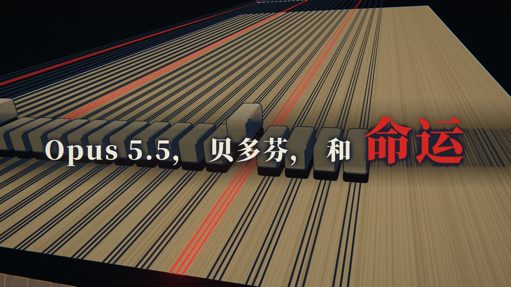

## 片子

| | 音乐 | 画面 |
|---|---|---|
| 开场 | 乐团调音 | 黑场上的标题：《Opus 5.5，贝多芬，和命运》 |
| 1 | **贝多芬** 第五交响曲第一乐章，第 1–58 小节 | 钢琴内部的叩门（标题一个音一个词地砸出来），印刷乐谱上刻出的命运动机，乐团座位图与“预测下一个音”的终端，88 键，自动钢琴纸卷，光的城市 |
| 2 | **莫扎特** 第四十交响曲第一乐章，第 1–28 小节 | 洛可可青花瓷沙龙：彩绘瓷盘上演奏的弦乐，木管与圆号，用莫扎特的骰子游戏给每一小节“采样” |
| 3 | **维瓦尔第**《四季·夏》第三乐章，第 1–20 小节 | 暴风雨里的气象站：麦田就是频谱，被冰雹一排排削断，闪电落在每个突强上，配十四行诗的诗句 |
| 4 | **巴赫** d 小调托卡塔 BWV 565 | 管风琴就是机房：音管是服务器机架，音栓是超参数，谱架上的乐谱跟着演奏，玫瑰窗随和弦点亮 |
| 5 | **格里格**《山魔王的大殿》 | 山腹里的机房：矿车跑在五线谱铁轨上，循环越跑越快直到超频，皮影山魔，最后系统过载 |
| 6 | **贝多芬** 第七交响曲第二乐章 | 刻刀在空中把各声部刻成一枚光的扭索纹徽章，主题每加一层，就多一把刻刀 |
| 7 | **贝多芬** 第九交响曲第四乐章（欢乐颂） | 夜色里的世界地图，从维也纳开始一城一城点亮，直到全世界一起唱 |
| 8 | **贝多芬** 第五交响曲第三乐章到第四乐章，以及结尾 | 回到钢琴内部：黑暗里一根琴槌反复敲着定音鼓的 C，然后整屏转成金色，全片只有这里用金色 |
| 尾声 | 静默 | “人生短暂，艺术长存”（希波克拉底），以及献词 |

调性从 c 小调出发，经过 g、d、b、a 小调，最后落到终曲的 C 大调。红色只给命运动机，金色只给终曲。每首曲子有自己的画面语言和调色，前后两段靠首尾画面的呼应衔接。中英两版只有标题、一行字幕和尾声不同。

<table>
<tr><td width="33%">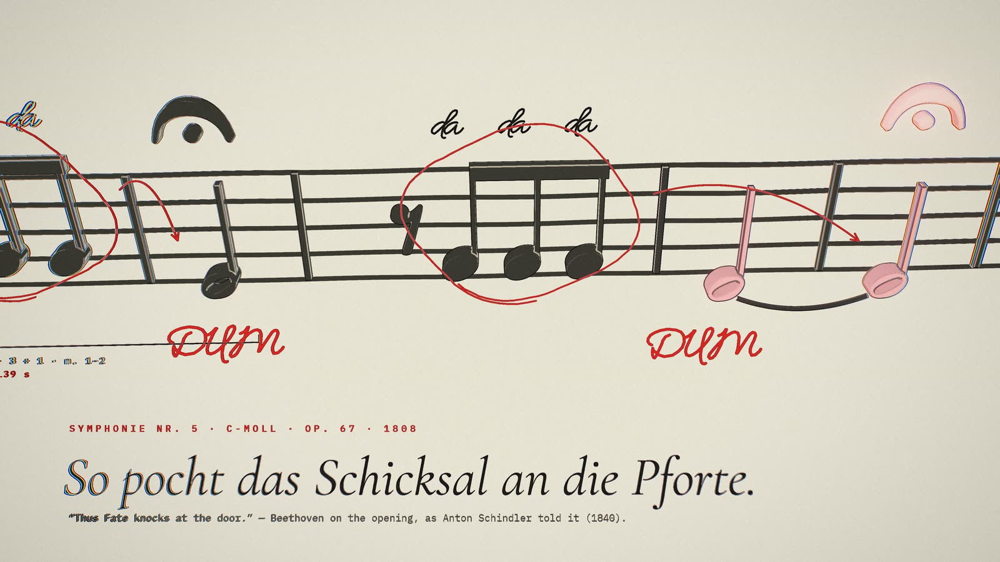<br><sub>贝五：刻出来、批注过的叩门动机</sub></td><td width="33%">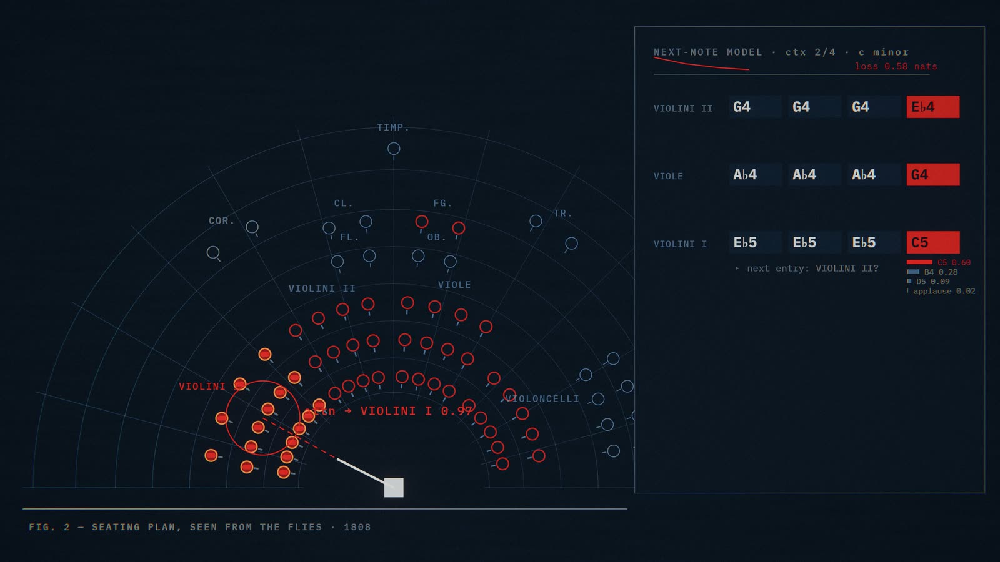<br><sub>贝五：乐团座位图与预测下一个音的终端</sub></td><td width="33%">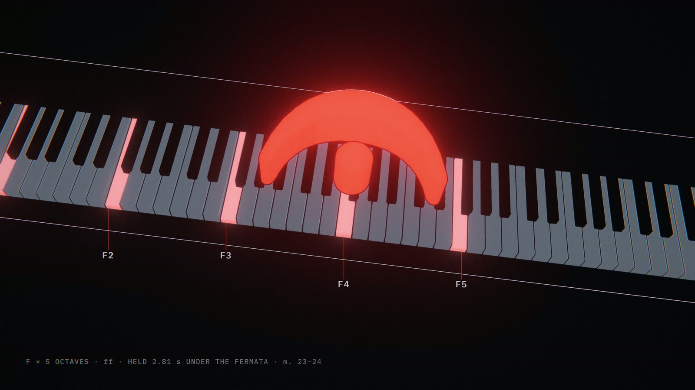<br><sub>贝五：延长记号下的 88 键</sub></td></tr>
<tr><td width="33%">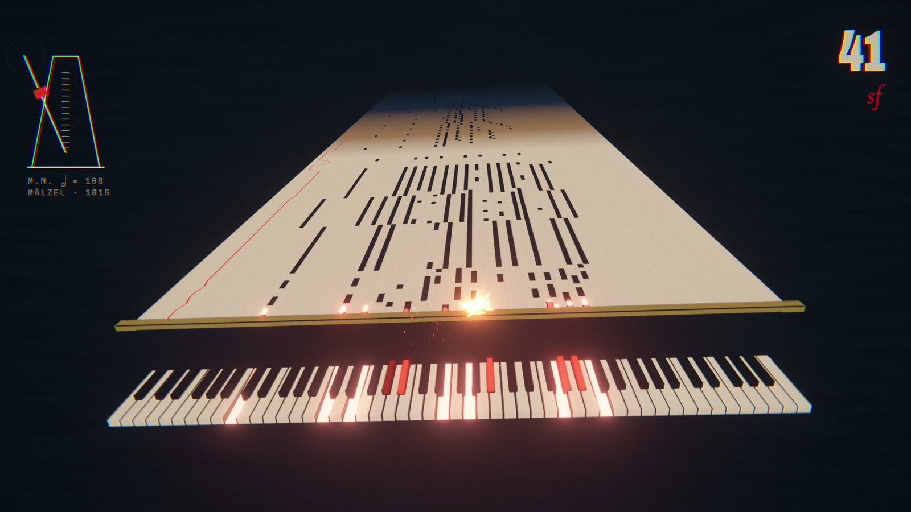<br><sub>贝五：自动钢琴纸卷</sub></td><td width="33%">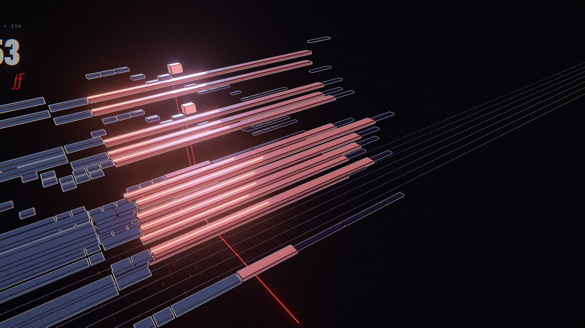<br><sub>贝五：光的城市</sub></td><td width="33%">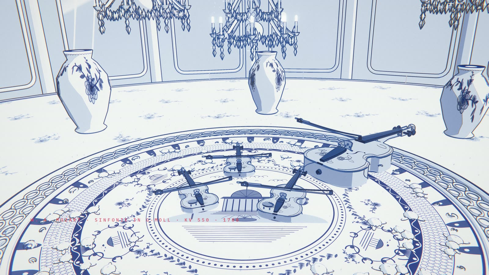<br><sub>莫扎特：洛可可青花瓷沙龙</sub></td></tr>
<tr><td width="33%">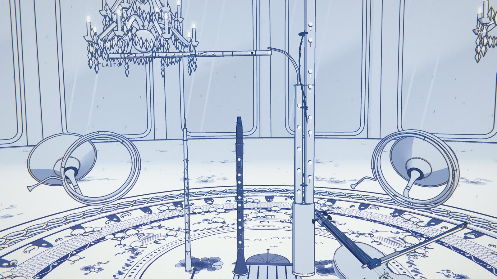<br><sub>莫扎特：木管与圆号</sub></td><td width="33%">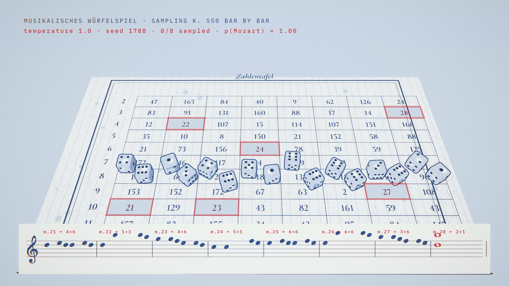<br><sub>莫扎特：给每一小节“采样”的骰子游戏</sub></td><td width="33%">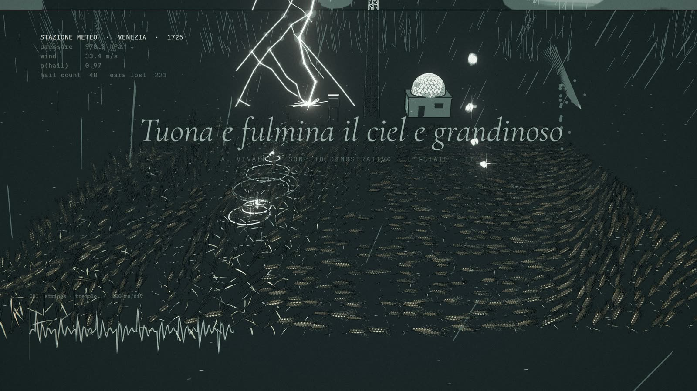<br><sub>维瓦尔第：麦田上的冰雹与闪电</sub></td></tr>
<tr><td width="33%">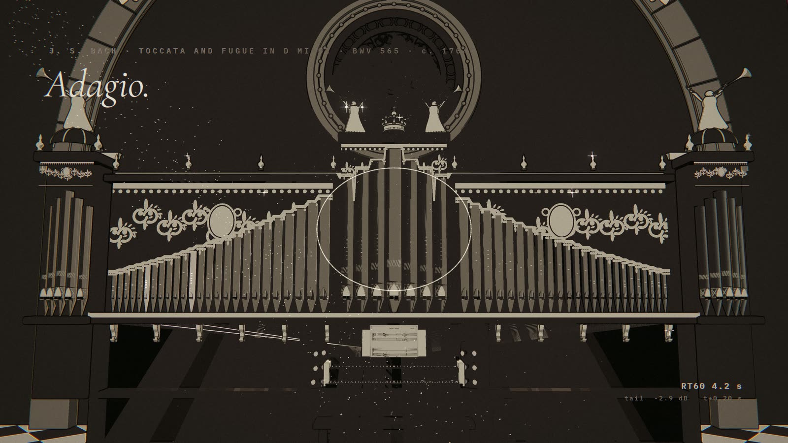<br><sub>巴赫：管风琴就是机房</sub></td><td width="33%">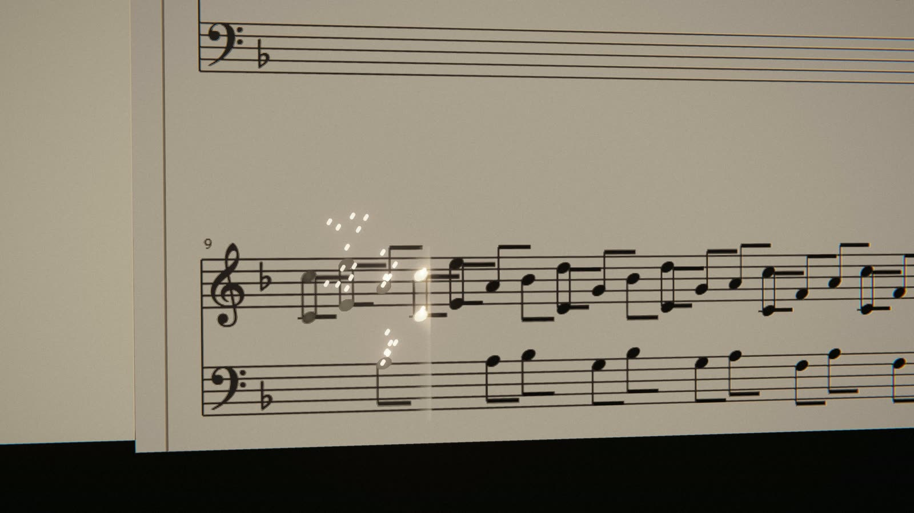<br><sub>巴赫：谱架上跟着演奏的托卡塔</sub></td><td width="33%">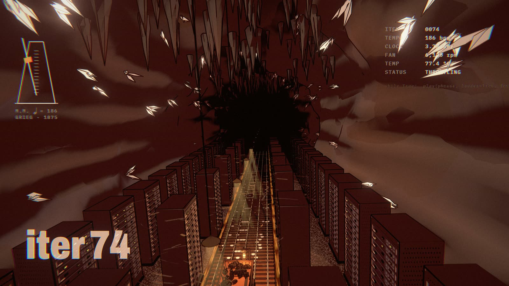<br><sub>格里格：山腹里的机房</sub></td></tr>
<tr><td width="33%">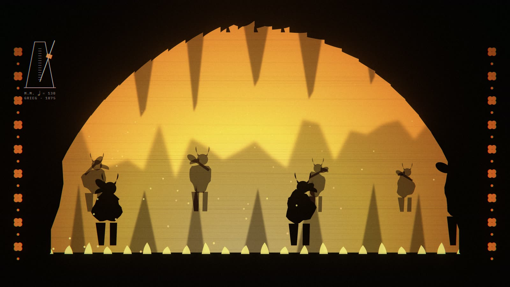<br><sub>格里格：皮影山魔</sub></td><td width="33%">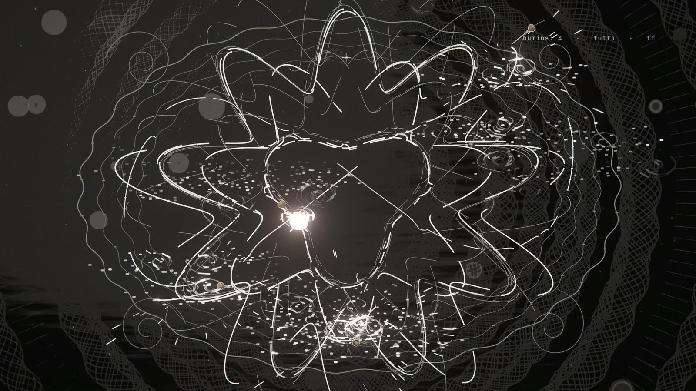<br><sub>贝七：刻刀刻出的徽章</sub></td><td width="33%"><br><sub>欢乐颂：全世界点亮</sub></td></tr>
<tr><td width="33%">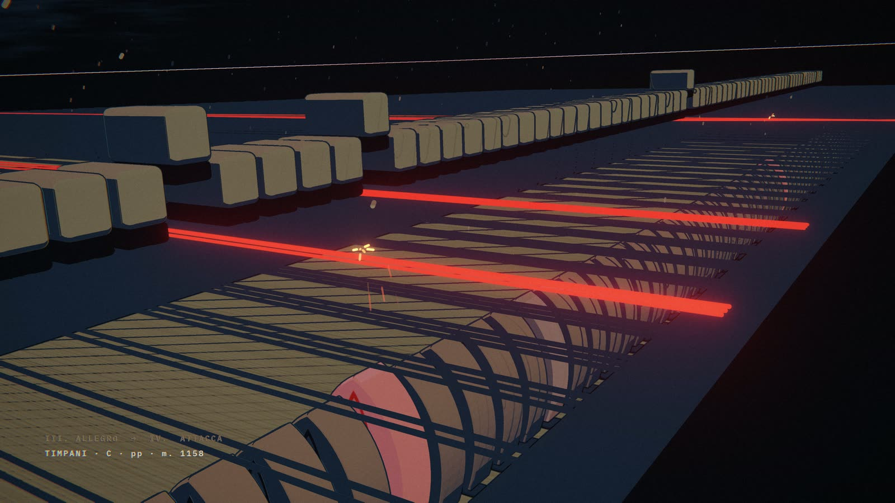<br><sub>终曲：黑暗里敲着定音鼓 C 的琴槌</sub></td><td width="33%">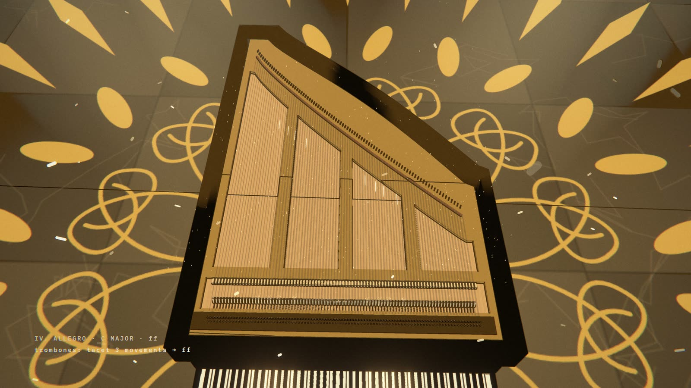<br><sub>终曲：钢琴里的金色</sub></td><td width="33%">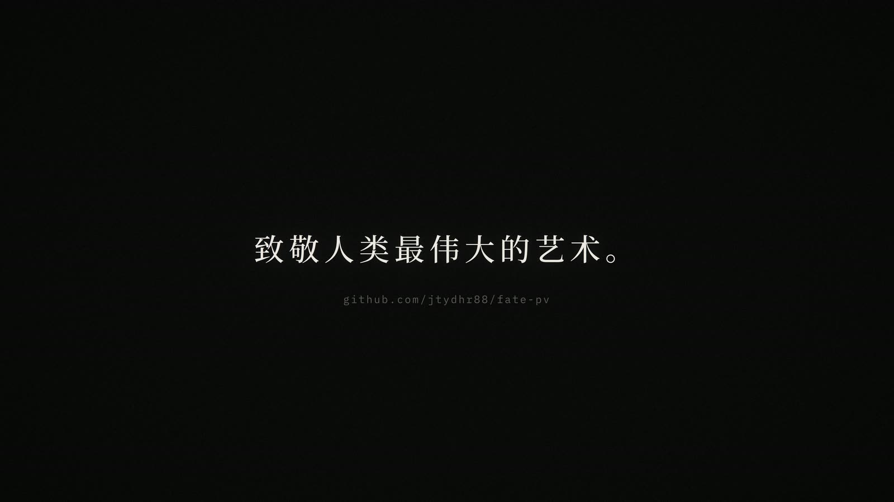<br><sub>尾声</sub></td></tr>
</table>

## 路线图

目前这个仓库只为这一支片子服务：场景、剪辑和数据都是为这支视频写的。以后它可能会改造成一个能做同类片子的工程项目：

- **自定义乐谱**：放进一份 MusicXML 或 MIDI，标出要用的小节和速度上的处理，就能得到时间数据、采样乐团的音频和一版粗剪。音乐这一侧现在已经只靠乐谱数据就能跑通。
- **按乐谱特征生成画面**：分析一份乐谱有哪些特征（动机在声部之间传递、延长记号和全团休止、同音反复的震音、越跑越快的固定音型、声部一层层进入、从小调转到大调），为每种特征提供对应的场景模板，就像这支片子里每一段回应它那段音乐一样。
- **可调整的镜头**：把镜头表做成可编辑的数据（关键帧、焦距、卡在拍点上的剪辑），在预览里直接调，镜头路径不再写死在每个场景的代码里。
- **特效设计**：粒子、调色、描边和后期整理成可复用、可调参数的预设。
- **由 agent 驱动**：编程 agent 读乐谱、提出场景和镜头方案、渲预览、根据意见反复修改，也就是我们做这支片子的方式。

这些都只是设想，等这支片子完成之后再看往哪个方向走。

## 灵感来源

[**mexicat/pdoom-video**](https://github.com/mexicat/pdoom-video)：歌曲《I'm Upping My P(doom)》的 MV，同样由 Claude 在 Claude Code 里写成代码渲染。我们的渲染器以它为起点（MIT 许可，见 `LICENSE.pdoom-engine`）：每一帧都是时间的纯函数，自适应运动模糊，辉光、光晕、颗粒等后期，用无头 Chrome 导出给 ffmpeg。方法也学自它：每段一种画面语言、一个具体物件，先写风格圣经再写代码。它的歌词层，在这里换成了乐谱层。

## 相关项目

我们给 Claude 用的专业技能库，和这个项目一起使用：

- [screenwriting-skills](https://github.com/jtydhr88/screenwriting-skills)：编剧（电影、剧集、戏剧）
- [music-composition-skills](https://github.com/jtydhr88/music-composition-skills)：作曲与编曲
- [lyric-writing-skills](https://github.com/jtydhr88/lyric-writing-skills)：歌词写作

## 目录

- `score/`：乐谱来源，各自的许可见 [`score/SOURCES.md`](score/SOURCES.md)（Mutopia、IMSLP、OpenScore；公有领域、CC0、CC BY、CC BY-SA）。手工转写的乐谱在 `analysis/scores/`。
- `analysis/`：音乐这一侧，Python（uv）：
  - `setlist.py`：音乐上的剪辑，用哪首曲子的哪几小节（一首可以剪几刀），速度（分小节变速、渐快），延长记号和小节内的停顿，休止，力度；
  - `build.py`：把它变成 `data/score.json`（每个音的精确秒数、小节、段落、命运动机），合成 `audio/fate.wav`，写出 `data/audio.json`（包络和起音，按曲目各自归一化）；
  - `vsco.py`：采样乐团，用 sfizz 渲染 VS Chamber Orchestra CE，每个声部按奏法缓存一条音轨，配 CC11 表情曲线；`build.py --gm` 可退回 GM 音色的草稿；
  - `opening.py`：开场前的调音，`data/opening.json`（开场和尾声的时长）；
  - `fonts.py`：中文字体子集；`b9_world.py`：世界地图数据。
- `app/`：渲染器，TypeScript + three.js，pnpm + Vite：
  - `src/engine/`：引擎、后期（调色、辉光、颗粒）、乐谱接口、SMuFL 刻谱、字体；
  - `src/scenes/`：每段一个模块，加上它的辅助文件（`<段名>-*.ts`）；共用部件在 `_kit.ts`（舞台、描边、五线谱、火花）和 `_piano.ts`（键盘与击弦机）；
  - `src/timeline.ts`：画面上的剪辑，每段的时间窗口挂在乐谱的小节上；
  - `scripts/render.ts`：离线渲染（静帧、接触印样、分段缓存、预览）。
- `docs/TREATMENT.md`：概念、配色、规则、各段一览。

## 环境

Node ≥ 22.18 和 pnpm，Google Chrome（由 playwright-core 无头驱动），带 libx264 的 ffmpeg。音乐这一侧需要 [uv](https://docs.astral.sh/uv/)、[sfizz](https://github.com/sfztools/sfizz) 的 `sfizz_render`，以及 [VSCO 2 CE](https://github.com/sgossner/VSCO-2-CE) 的采样和它 `SFZ` 分支里的 sfz 文件；草稿音频（`--gm`）需要一个 General MIDI 音色库。它们的位置用 `FATE_VSCO`、`FATE_SFIZZ`、`FATE_SF2` 指定，可以设成环境变量，也可以写进 `analysis/paths.local.json`（已被 git 忽略，格式见 `analysis/paths.py`）。

## 生成数据和音频

```sh
cd analysis
uv run python opening.py     # 调音，开场和尾声的时长
uv run python build.py       # score.json、乐团音频、audio.json
```

## 预览

```sh
cd app
pnpm install
pnpm dev                     # 加 ?lang=en 看英文标题
```

空格播放 / 暂停，←/→ 前后跳 1 秒（按住 shift 跳 5 秒），`,`/`.` 逐帧，`[`/`]` 上一段 / 下一段，`l` 循环当前段，`h` 隐藏界面。`?t=16` 从指定时间开始。

## 画面风格

- **卡通着色**（`engine/style.ts`）：分几档平涂色阶，再从法线和深度勾出墨线（`scenes/_kit.ts` 里的 `Outline`）。`?style=pbr` 可切回写实材质对比。
- **调色**（`engine/palette.ts`，在时间线里按段设置）：每段按亮度把画面映射到自己的四色组（`wood`、`paper`、`night`、`steel`、`dusk`、`porcelain`、`storm`、`stone`、`cave`、`ash`、`dawn`、`gold`），分档时边缘带一点柔和过渡。高饱和的颜色（命运的红、玫瑰窗）保持原色。
- **2D 层**叠在上面：单线笔字体的手写批注、仪器读数、皮影、地图。
- **粒子**：火花、刨屑、光柱里的浮尘、冰雹、余烬、闪粉。

## 渲染

```sh
cd app
pnpm render stills --t 0.2,3.1,16.6 --only knock1          # 静帧，存到 out/stills
pnpm render sheet --from 20 --to 38 --n 16 --only rise      # 接触印样
pnpm render segments --preview --lang zh                    # 快速预览：960x540，不做运动模糊
pnpm render segments --lang zh --samples auto --max-samples 36 --shutter 0.25 --out ../out/fate.mp4
pnpm render segments --scale 2 ...                          # 3840x2160
```

### 分段缓存

时间线上的每一段单独渲成一个片段，并为它算一个“指纹”，包含所有会影响画面的东西：这一段的场景代码和它引用的文件、引擎、它自己在时间线上的设置、它时间范围内的乐谱和音频数据、渲染参数，带标题的段落还包括语言。下次渲染时，只重渲指纹变了的段落（被替换下来的旧片段保存在 `history/`），再无损拼接，统一配上音轨（开场的调音、音乐、尾声的静默）。每一帧只由时间决定，所以单独渲一段和整片渲得到的画面完全一样。音频这一侧也做了同样的安排：总增益固定，混响分块计算，每首曲子各自归一化，所以改一首曲子，其他曲子的数据逐位不变，它们的片段也不用重渲。

`--samples auto` 每帧平均 4 到 324 个子帧，直到运动模糊收敛（见 pdoom-video 的 ENGINE.md，“Motion blur and sampling”一节）；`--max-samples 36` 给它设个上限。

### 多台机器一起渲

`--segdir` 把缓存指向一个共享目录；每台机器渲一段之前先“认领”，别的机器看到认领就跳过。`--order reverse` 让第二台机器从队尾开始，两台从两头往中间做；`--no-join` 把拼接留给其中一台。没有 Google Chrome 的 Linux 机器用 `--chrome <路径>`（比如 Playwright 自带的 Chromium）；无头 Linux 上通过 EGL 调用显卡（脚本会自动设置）。例如一台 aarch64 的 Linux 机器（这里是 NVIDIA DGX Spark）和一台 Windows 工作站共用同一个共享目录：

```sh
pnpm render segments --chrome /path/to/chrome \
  --segdir /mnt/shared/fate-pv/segments --order reverse --no-join --samples auto --max-samples 36
```

## 致谢

- **音乐**：贝多芬第五（Op. 67）、第七（Op. 92）、第九（Op. 125）交响曲；莫扎特第四十交响曲（K. 550）；维瓦尔第《夏》（RV 315）；巴赫 d 小调托卡塔（BWV 565）；格里格《山魔王的大殿》（Op. 23）。乐谱来自 Mutopia Project（公有领域；维瓦尔第为 CC BY-SA 3.0）、IMSLP #955212（Gaylon Babcock 排版，CC BY 4.0，由我们转写）、Muxi Xie 的 CC0 贝五“超还原”钢琴缩谱、OpenScore 的 CC0 贝九（由我们转写）。完整清单见 `score/SOURCES.md`。
- **乐团采样**：VS Chamber Orchestra Community Edition（CC0），Versilian Studios；用 sfizz 渲染。
- **地图数据**：Natural Earth（公有领域）。
- **引擎**：mexicat/pdoom-video（MIT）。
- **字体**：Bravura（SIL OFL，Steinberg）、Archivo、IBM Plex Mono、Cormorant Garamond、Noto Serif SC、GFS Didot（SIL OFL）；Hershey/EMS 单线笔字体经由 pdoom-video。
